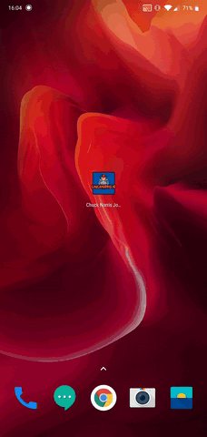

# Learning Kotlin

## Main goal
The goal of this project is to make an app that displays Chuck Norris Jokes from an API. You can remove jokes, move them, share them and add to your favourites to keep them for later.

## Branches

* [part1] Create a UI List component
* [part2] Fetch jokes
* [part3] Display jokes on screen
* [part4] Make UI great again
* [MVVM] MVVM architecture
* [master] Final application

## Example use

